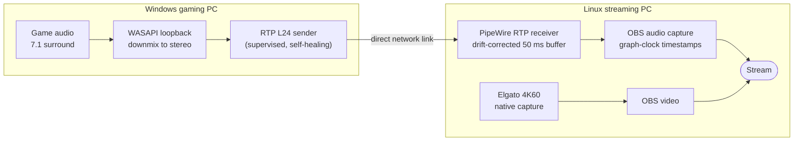

# AV Sync Bridge

**Game audio from one PC, video from a capture card on another, locked together within a frame.**

Desktop audio from a Windows gaming PC (played in 7.1 surround) is downmixed to
stereo, streamed over a direct network link to a Linux OBS machine, and kept in
sync with 4K60 video from an Elgato capture card. Every part of the timing is
measured, not assumed.


---

## Results at a glance

| | Before | After |
|---|---|---|
| Audio restarts while streaming | up to 60 per hour (research bridge) | 0 across 3 h 21 min of uptime, including a 1 h 40 min live session |
| Audio marker timing inside OBS | jumps of 20 to 60 ms (stock PulseAudio capture) | within 1 ms of schedule (patched PipeWire capture) |
| Recovery from a failure | both ends torn down and relaunched over SSH | capture restarts alone in about 2 s, receiver never exits |

Also measured on the production path: zero receiver underruns with the OBS
machine stressed to a load of 17 on 8 cores, zero packet loss across 27,600
captured packets, and a calibrated A/V offset that stays within one video frame
(about 17 ms at 60 fps).

All figures come from the real rig (Windows gaming PC, Ubuntu 24.04 OBS machine,
Elgato 4K X, direct Mellanox link) and are written up with method and raw numbers
in [docs/rtp-path.md](docs/rtp-path.md).

## The problem

A two-PC streaming setup splits the work: one machine plays the game, the other
captures and encodes it. The video arrives at the streaming machine through a
capture card, but the game audio lives on the gaming PC, in 7.1 surround.
Sending it over the network is easy. Keeping it locked to the video through long
sessions, restarts, and a streaming machine that is busy encoding 4K60 is the
hard part.

## How it works



- **Sender (Windows).** GStreamer captures whatever the PC is playing, downmixes
  7.1 to stereo with a fixed matrix, and sends uncompressed 24-bit audio in 2.5 ms
  packets. A small supervisor restarts the pipeline within about two seconds if it
  ever stops, and a scheduled task keeps the supervisor itself alive.
- **Receiver (Linux).** PipeWire's built-in RTP receiver continuously adjusts its
  playback rate to hold a constant 50 ms buffer, so the two machines' clocks can
  never drift apart. Gaps, silence and sender restarts are absorbed in place.
- **OBS.** Audio is captured with a patched PipeWire plugin that timestamps each
  block with the audio graph's own clock, on a realtime thread. Video comes
  straight from the capture card with no delay filters.
- **Calibration.** A fixed sync offset, measured with the automatic test below.

## Measuring sync, not guessing it

`tools/av-reference.html` plays six markers, each a cyan flash paired with its own
tone (660 to 1760 Hz) at irregular times. Because no two markers are alike, a
measurement can never lock onto the wrong one, which is a common failure of
repeating click-and-flash tests.

`rtp/windows/run_sync_test.py` runs the whole procedure unattended: it opens the
reference in a controlled Chrome window on the captured screen, records through
OBS, analyzes the recording frame by frame on the streaming machine, and reports
the offset of every marker plus a suggested correction.

Output from a real run on the rig:

```text
audio minus video per marker (ms): -15.0, -15.3, -16.3, +1.0, -16.0, -15.3
median: -15.3 ms   spread: 17.3 ms   (positive = audio later)
GATE: PASS
```

The gate passes when the median is within one frame (16.7 ms) and every marker is
within two frames (33.3 ms). The one marker at +1.0 ms is the flash landing on the
neighbouring video frame, which is ordinary 60 fps frame quantization.

## Engineering notes

The project started as a research bridge: a custom C++ sender and receiver with
explicit capture timestamps, sample-accurate resampling and strict timing checks
at every stage. It measured beautifully and proved where every millisecond went,
but it was built to stop at the first sign of trouble, and on a busy streaming
machine that meant frequent restarts.

The production path keeps what the research proved and swaps the fragile parts
for components designed to run for days. Getting there turned up three problems
outside the audio transport itself, each worth checking on any similar setup:

1. **OBS's PulseAudio capture** timestamps audio by when its thread happens to
   wake up, which wobbled the audio timeline by tens of milliseconds under load.
2. **PipeWire was running without realtime priority** since boot, because it
   started before the realtime service was ready.
3. **A leftover helper script** kept silently switching the OBS audio input back
   to a retired device every ten seconds.

The full write-up, including fault-injection results, is in
[docs/rtp-path.md](docs/rtp-path.md).

## Repository layout

| Path | Contents |
|---|---|
| [`rtp/`](rtp/) | Production path: Windows sender and task installer, PipeWire receiver config, OBS plugin patch, automatic sync test |
| [`docs/rtp-path.md`](docs/rtp-path.md) | Design, setup guide, measurements and known limits of the production path |
| [`tools/`](tools/) | Reference page, recording analyzers (`measure_physical.py` and others), test harnesses |
| [`src/`](src/), [`include/`](include/), [`apps/`](apps/) | Research core: timing math, bounded IPC, RTP clock anchors, resampling, V4L2 capture, sender and receiver |
| [`plugins/obs/`](plugins/obs/) | Research OBS source that plays timestamped audio and video from shared memory |
| [`docs/`](docs/) | Design notes and validation records for every research milestone |

## Getting started

Setting up the production path takes a Windows PC with GStreamer 1.24+ and
Python 3.10+, and a Linux OBS machine running PipeWire 1.0+. The step-by-step
guide is in [docs/rtp-path.md#setup](docs/rtp-path.md#setup).

### Building the research core

C++20 and CMake 3.24 or newer. The default build is the portable core plus
synthetic IPC tools on Linux; it does not install anything or touch OBS.

```sh
cmake -S . -B build -DCMAKE_BUILD_TYPE=Release
cmake --build build --config Release --parallel
ctest --test-dir build -C Release --output-on-failure
```

The default build does not install an OBS plugin, capture real media, open
network ports or touch an OBS profile. See [docs/building.md](docs/building.md)
for the optional OBS, network and capture targets.

### Research write-ups

Each milestone of the research bridge has its own design note and validation record:

- [Architecture](docs/architecture.md) and [timing contracts](docs/timing.md)
- [Bounded shared-memory IPC](docs/ipc.md)
- [Asynchronous resampling validation](docs/asrc-validation.md), including a 600 s generated-marker case
- [Audio correction worker](docs/audio-correction.md) and its [phase safeguard](docs/audio-phase-guard.md)
- [Startup and desktop handoff](docs/startup-handoff-validation.md)
- [Physical marker measurement](docs/physical-measurement.md) and the [instrumented browser reference](docs/browser-reference.md)
- [Roadmap](docs/roadmap.md)

## Contributing

See [CONTRIBUTING.md](CONTRIBUTING.md) and [SECURITY.md](SECURITY.md). Please never
include real device identifiers, network addresses, credentials, recordings or
private scene collections in issues or pull requests.

## License

GPL-2.0-or-later. See [LICENSE](LICENSE). OBS Studio, PipeWire, GStreamer and
obs-pipewire-audio-capture keep their own licenses. This project is independent of
the OBS Project and of any capture hardware vendor.
