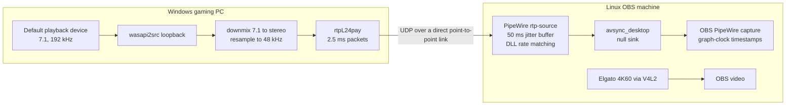

# Production path: RTP desktop audio

This is the path that runs the live stream today. It replaced the leased
sender/receiver pair (`apps/windows_sender.cpp`, `apps/network_receiver.cpp`,
`tools/process_pair.py`) on 2026-09-24. The research components are still in the
repository because the measurement tools, reference page and analyzers are what
proved the new path works.

## Why the first design was replaced

The original bridge was built as a fail-closed measurement harness. Every stage
checked hard timing limits (anchor age 250 ms, queue age, a 200 ms handoff
deadline) and exited the process when one was missed. Recovery meant tearing
down and relaunching both ends over SSH.

That is the right behaviour for a lab instrument and the wrong one for a stream.
On the OBS machine (load average around 9 on 8 cores while streaming 4K60) those
limits were missed routinely, which produced restart storms of 60+ per hour and
long silent gaps.

## Signal path

| Stage | Component | Behaviour on trouble |
|---|---|---|
| Capture and send | `rtp/windows/desktop_rtp_sender.py` supervising one `gst-launch-1.0` | Restarts the pipeline within about 2 s if it exits or sends nothing for 3 s. Every packet is also copied to loopback and counted, so liveness is measured on real output. Children sit in a kill-on-close job object. |
| Keep it running | Windows scheduled task with a 1-minute trigger | Revives the supervisor if it ever dies. Enabled means on, disabled means off. |
| Receive | PipeWire `module-rtp-source`, own `pipewire -c` process under systemd | Continuous rate matching holds the buffer at 50 ms. Silence, sender restarts and new SSRCs resync in place. Nothing exits. |
| Hand to OBS | `avsync_desktop` null sink | OBS records a sink that always exists, so a receiver restart never removes OBS's source. |
| Timestamp | obs-pipewire-audio-capture with `rtp/obs/*.patch` | Audio is stamped with the PipeWire graph clock in the realtime data thread instead of whenever an OBS thread wakes up. |

The downmix keeps the original sender's policy so OBS levels did not change:
LFE dropped, centre, rear and side at -3 dB, one common gain with 10% headroom.

## Measurements

All numbers are from the real rig: a Windows gaming PC, an Ubuntu 24.04 OBS machine
with an Elgato 4K X, and a direct Mellanox point-to-point link between them.

**Transport.** A packet capture of 27,600 RTP packets showed no sequence gaps and
perfectly contiguous timestamps. Decoding the captured payload, the six reference
tones were within 0.1 ms of their scheduled spacing. The receiver logged zero
underruns while twelve busy loops pushed the OBS machine to a load of 17.

**Fault injection.**

| Fault | Result |
|---|---|
| Kill the capture pipeline | Audio back in 2.4 s, restart logged with reason |
| Kill the sender supervisor | Revived by the scheduled task |
| Restart the PipeWire receiver | Relinked automatically, OBS kept its source |
| Restart pipewire-pulse (sink recreated) | Receiver waited for the sink and relinked |
| Full stop and start of the rig | Clean both ways |

**Sync.** Measured with `rtp/windows/run_sync_test.py` against the six-marker
reference. With graph-clock timestamps and a realtime OBS audio thread, the audio
markers land within 1 ms of their schedule. What remains is one video frame of
quantization (plus or minus 17 ms at 60 fps). Across OBS restarts the best offset
fell between +16 and +37 ms, so the rig runs at +26 ms. Gated passes (median
within 16.7 ms, every marker within 33.3 ms) measured medians of -15.3 and +13.8 ms.

**First real session.** A 1 h 40 min session with a game running and two live streams:
200 health samples at 30 s intervals showed the receiver up throughout with zero
underruns or resyncs, and the Windows sender ran 3 h 21 min with zero restarts.
The old path was restarting up to 60 times an hour under the same load.

## What it took to get there

Three problems sat outside the transport and each one cost real sync accuracy:

1. **OBS's PulseAudio capture** stamps audio with the time its reader thread
   happens to run. On a busy machine that wobbled the audio timeline by 20 to 60 ms.
   The PipeWire capture plugin plus the patch in `rtp/obs/` removed it.
2. **PipeWire itself had no realtime priority** because it started before rtkit
   at boot. Adding the user to the `pipewire` group (the stock
   `/etc/security/limits.d/25-pw-rlimits.conf`) fixes it permanently.
3. **An old helper script** kept forcing the OBS input back to a retired device
   every 10 seconds. Worth checking for on any machine with history.

## Setup

**Linux (OBS machine)**

1. Copy `rtp/linux/windows-desktop-rtp.conf` to `~/.config/avsync-rtp/` and set
   `local.ifname` and `source.ip` for your link.
2. Add the null sink from `rtp/linux/pipewire-pulse.conf.d/` and restart
   `pipewire-pulse`.
3. Install `rtp/linux/avsync-rtp-receiver.service` into `~/.config/systemd/user/`,
   then `systemctl --user enable --now avsync-rtp-receiver`.
4. Build [obs-pipewire-audio-capture](https://github.com/dimtpap/obs-pipewire-audio-capture)
   with the patch applied, install it as an OBS plugin, and add an
   "Audio Output Capture (PipeWire)" source targeting `avsync_desktop`.
5. After OBS starts, run `rtp/linux/promote-obs-audio-thread.sh`.

**Windows (gaming PC)**

1. Install GStreamer 1.24 or newer (MSVC build) and Python 3.10+.
2. Run `rtp/windows/install-sender-task.ps1 -Target <linux-ip>:46000 -GstLaunch <path>`.
3. Run `rtp/windows/run_sync_test.py` once and apply the suggested offset.

If the reference page aborts with `animation_frame_gap` on a PC that drops the odd
display frame, raise `adaptiveGapMultiplier` in a copy of
`tools/reference-timeline.mjs` and point `--reference-dir` at it.

## Known limits

- The OBS video path is native V4L2 with buffering off. Which frame a flash lands
  on can shift by one between OBS restarts, which is the plus or minus 17 ms above.
- Other PulseAudio inputs in OBS can still raise OBS's global audio buffering.
  They add stream latency, not desync, and move to the PipeWire plugin the same way.
- The microphone is not on this path yet.
